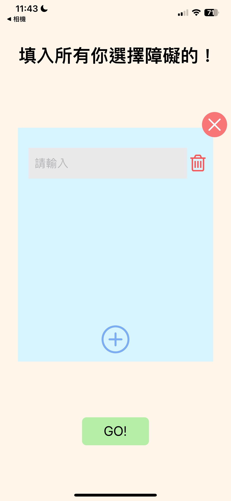
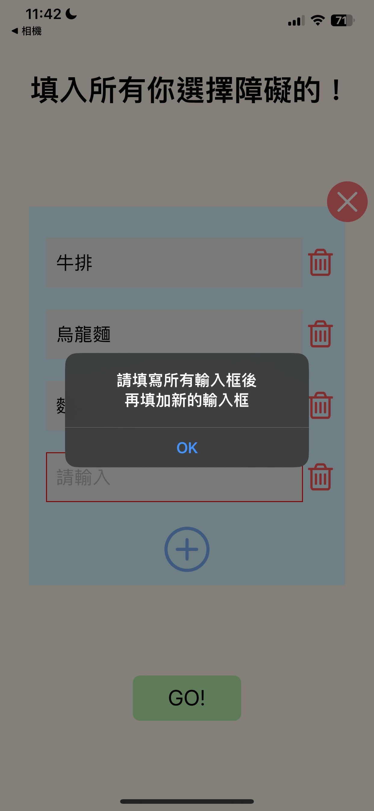
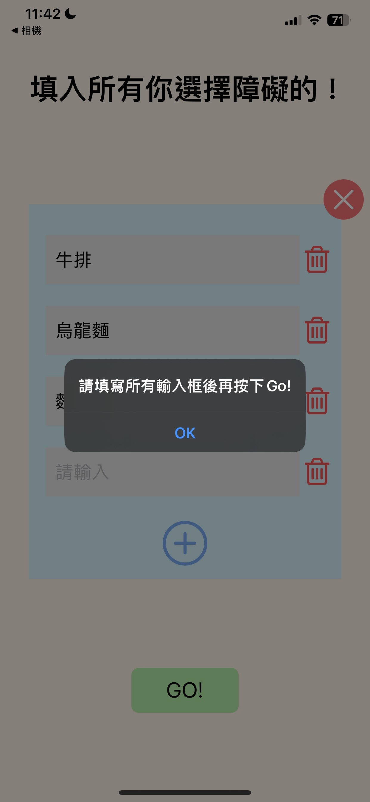
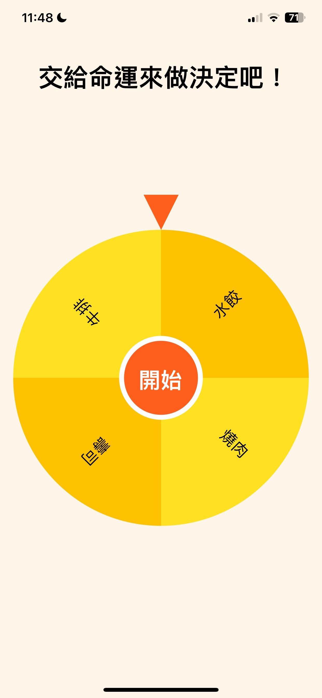
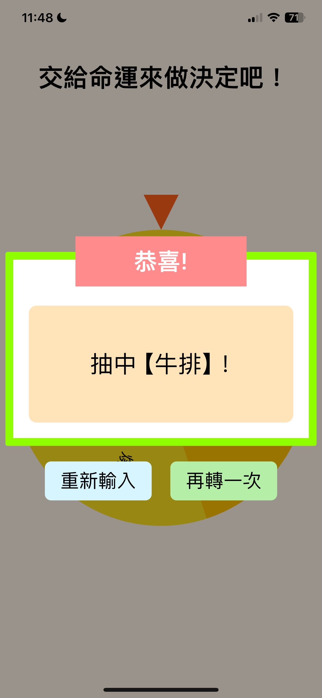

# 選擇障礙神器 ChooseApp
### 還在選擇障礙嗎? 
### 那就快來使用 【選擇障礙神器】, 這是一款可以幫你決定任何東西的App!

>專案使用到的工具
1. Redux Toolkit 
2. React Native Elements

> 動畫效果
1. 首頁 打字機 效果
2. 首頁 YES!、NO! 彈跳效果
3. 新增 刪除input 的 淡入淡出 效果
4. 新增 關閉form 的 淡入淡出 效果
5. 輪盤 的 旋轉效果

## 首頁

## 點下 [ NO! ] 按鈕 
<!--  -->

## 點下 [ YES! ] 按鈕 
<!--  -->

## 填入選項

## 點下 [ + ] 選項,如果上面的選項有沒有填到的,則會跳出提示

## 點下 [ Go! ] ,如果上面的選項有沒有填到的,則會跳出提示

## 點下 [ Go! ] 進入 輪盤頁面, 按下 [ 開始 ] 就開始轉動輪盤!

## 輪盤停下來, 就會跳出 選中的那個!

